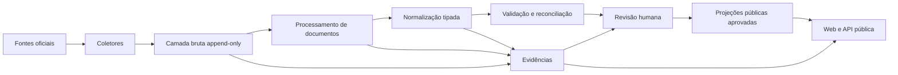

# Arquitetura

## Decisão central

Começar como **monólito modular orientado a dados, com workers assíncronos**.
As pastas representam limites futuros; não representam onze serviços que devam
ser implantados agora. Nesta etapa, somente banco, contratos, coletor do Querido
Diário e testes estão ativos.

## Componentes

| Caminho | Papel | Estado inicial |
|---|---|---|
| `apps/web` | Portal público Next.js | esqueleto |
| `apps/admin` | Revisão humana Next.js | esqueleto |
| `apps/public-api` | API pública versionada | contrato futuro |
| `services/ingestion-api` | Controle interno de ingestão/health | esqueleto |
| `services/agent-runtime` | IA assistiva e auditável | desativado |
| `workers/collectors` | Aquisição de fontes | Querido Diário ativo |
| `workers/document-processing` | PDF, texto, OCR, páginas e trechos | esqueleto |
| `workers/normalization` | Derivações tipadas | esqueleto |
| `workers/reconciliation` | Identidade e conflitos | esqueleto |
| `workers/anomaly-detection` | Regras determinísticas | desativado |
| `packages/database` | SQL, acesso e transações | fundação |
| `packages/data-contracts` | JSON Schemas canônicos | fundação |
| `packages/evidence` | hashing e cadeia de evidência | esqueleto |
| `packages/methodology` | regras e versões públicas | esqueleto |

## Camadas de dados

### `source`

Cadastro de fontes, endpoints e execuções. Uma execução tem estado explícito,
janela de coleta, cursor, contadores, erro e versão do coletor/parser.

### `raw`

Artefatos e registros recebidos. É append-only. Um artefato é identificado por
SHA-256 do conteúdo, não por URL. A mesma URL pode entregar conteúdos diferentes
e o mesmo conteúdo pode aparecer em URLs diferentes.

Objetos grandes ficam em armazenamento privado compatível com S3 ou em um
adaptador equivalente. O PostgreSQL mantém hash, tamanho, MIME detectado,
object key, cabeçalhos relevantes e metadados de coleta. A
escrita usa chave endereçada pelo SHA-256 e não permite upsert. O worker restaura
o objeto e verifica hash/tamanho antes de abrir a curta transação que registra
execução, observação e registros brutos. Se o banco falhar, o objeto permanece
como órfão seguro e o retry reutiliza a mesma chave.

O mesmo objeto pode ser referenciado por várias observações. `raw_artifacts`
representa a observação — URL, horário e execução — e não impõe unicidade à
`object_key`. `raw_records` permite uma versão por
`(raw_artifact_id, record_index, parser_version)`.

Em desenvolvimento e testes, `PERSISTENCE_MODE=filesystem` grava os mesmos
objetos em `data/local-evidence/objects` e manifestos canônicos em
`data/local-evidence/manifests`. Esse acervo é append-only, detecta adulteração e
fica fora do Git. Não substitui PostgreSQL nem pode ser usado em staging ou
produção. A decisão está no ADR 0008.

### Domínios normalizados

- `org`: órgãos e departamentos;
- `hr`: pessoas, cargos, atos, concursos e folha minimizada;
- `procurement`: fornecedores, compras, itens, propostas, contratos e obras;
- `finance`: receitas e estágios da despesa;
- `analysis`: regras e achados;
- `editorial`: revisão, publicação, conflitos e alertas;
- `evidence`: ligações entre afirmações derivadas e origem;
- `audit`: eventos de auditoria.

### `api`

Somente projeções aprovadas, com views `security_invoker` ou tabelas de leitura
específicas. O browser não acessa os schemas internos. O esquema não será
exposto pela Data API até grants e RLS serem revisados.

## Identificadores

- IDs internos: `bigint generated always as identity`;
- IDs externos: preservados como texto e únicos dentro da fonte;
- chave de idempotência: composta por fonte, endpoint, identidade externa,
  janela/cursor e versão do contrato;
- documentos: SHA-256 em hexadecimal minúsculo;
- entidades expostas futuramente: identificador público opaco, distinto do ID
  sequencial quando enumeração representar risco.

## Temporalidade e versão

Datas de negócio (`act_date`, `effective_from`) não se confundem com:

- `collected_at`: quando recebemos;
- `observed_at`: quando a fonte declarou/alterou;
- `valid_from`/`valid_to`: intervalo da versão normalizada;
- `published_at`: quando a revisão autorizou exibição.

Correção encerra a validade da versão anterior e cria outra. Artefatos e eventos
de auditoria não são atualizados para “corrigir” o passado.

## Evidência

`evidence_items` é polimórfica de forma controlada: identifica tipo e ID do
registro derivado, mas mantém FKs reais para `raw_artifacts`, `raw_records`,
`document_pages` e `extraction_results`. Um check exige ao menos uma origem.

Trechos usam offsets no texto canônico e, quando possível, página e bounding
box. O hash do trecho evita que uma mudança de OCR passe despercebida.

## Filas

Na primeira etapa, jobs duráveis no PostgreSQL usam claim atômico com
`FOR UPDATE SKIP LOCKED`, visibility timeout, número máximo de tentativas,
backoff e estado `dead_letter`. Chamadas HTTP ocorrem fora de transações.

Supabase Queues/PGMQ pode substituir essa implementação quando houver volume
ou operação que justifique. A adoção exige ADR e teste de replay/arquivamento.

## Busca

PostgreSQL inicialmente:

- `tsvector` português com índice GIN para texto;
- índices B-tree compostos para estado editorial + data;
- `pg_trgm` somente para busca tolerante de nomes;
- paginação por cursor (`data`, `id`), não OFFSET em páginas profundas.

## Observabilidade

Logs estruturados em JSON com `run_id`, `source_id`, `endpoint_id`,
`artifact_hash`, `attempt`, duração e resultado. Nunca registrar corpo completo,
segredo ou dado pessoal desnecessário.

Métricas mínimas:

- última coleta bem-sucedida por endpoint;
- latência, status HTTP e tentativas;
- itens vistos, novos, duplicados, rejeitados e em DLQ;
- idade do dado e lacunas de cobertura;
- backlog e tempo de revisão.

## Ambientes

- desenvolvimento local sem dados pessoais reais quando fixtures bastarem;
- acervo local real limitado, ignorado pelo Git e sem publicação;
- staging com buckets e banco separados;
- produção com admin, secrets e logs isolados;
- Vercel apenas para `apps/web` e `apps/admin`;
- collectors e APIs Python em runtime de worker/container adequado.

## Identidades de execução

O PostgreSQL possui um papel-base `collector_worker` sem login. O login real é
ativado fora das migrations sobre a role desabilitada
`collector_querido_diario`, que recebe esse papel e nunca usa o proprietário
`postgres`. Os grants permitem apenas ler cadastros, criar/atualizar estado de
coleta e inserir no bruto. Não há `DELETE` ou `UPDATE` em artefatos e registros
brutos.

No Storage, o mesmo workload autentica com chave publicável e usuário Auth
técnico. Uma allowlist interna associa seu UUID ao bucket `raw-artifacts`, ao
prefixo `querido-diario/gazettes/` e somente às operações `SELECT` e `INSERT`.
Não existe política de `UPDATE` ou `DELETE`. O coletor recusa chaves
secret/service role, que ignorariam RLS.

## Referências

- [API pública do Querido Diário](https://docs.queridodiario.ok.org.br/pt-br/latest/utilizando/api-publica.html)
- [RLS no Supabase](https://supabase.com/docs/guides/database/postgres/row-level-security)
- [Controle de acesso no Storage](https://supabase.com/docs/guides/storage/security/access-control)
- [Supabase Queues](https://supabase.com/docs/guides/queues)
