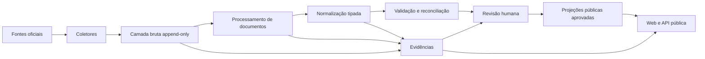
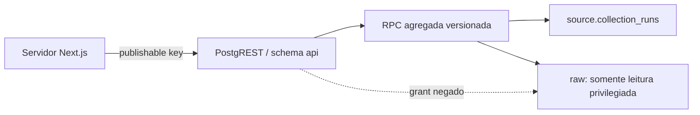

# Arquitetura

## Decisão central

Começar como **monólito modular orientado a dados, com workers assíncronos**.
As pastas representam limites futuros; não representam onze serviços que devam
ser implantados agora. Nesta etapa, somente banco, contratos, coletor do Querido
Diário e testes estão ativos.

## Componentes

| Caminho | Papel | Estado inicial |
|---|---|---|
| `apps/web` | Portal público Next.js | pré-lançamento ativo |
| `apps/admin` | Revisão humana Next.js | esqueleto |
| `apps/public-api` | API pública versionada | contrato futuro |
| `services/ingestion-api` | Controle interno de ingestão/health | esqueleto |
| `services/agent-runtime` | IA assistiva e auditável | desativado |
| `workers/collectors` | Aquisição de fontes | Querido Diário ativo |
| `workers/document-processing` | PDF, texto, OCR, páginas e trechos | esqueleto |
| `workers/normalization` | Derivações tipadas | esqueleto |
| `workers/reconciliation` | Identidade e conflitos | esqueleto |
| `workers/anomaly-detection` | Regras determinísticas | desativado |
| `packages/database` | SQL, acesso e transações | fundação |
| `packages/data-contracts` | JSON Schemas canônicos | fundação |
| `packages/evidence` | hashing e cadeia de evidência | esqueleto |
| `packages/methodology` | regras e versões públicas | esqueleto |

## Projeção pública inicial

O portal não consulta schemas internos. O schema exposto `api` contém somente a
função curada `get_querido_diario_collection_status()`, que entrega agregados
não reputacionais da coleta preservada. A role anônima pode executar essa
função, mas não possui `SELECT` em `raw.raw_records` ou `raw.raw_artifacts`.

A resposta recebe validação estrita de forma e versão metodológica no servidor,
timeout de cinco segundos e revalidação a cada cinco minutos. Ausência de
configuração, falha HTTP ou payload inesperado retorna “indisponível”; jamais é
convertida em contagem zero.

## Camadas de dados

### `source`

Cadastro de fontes, endpoints e execuções. Uma execução tem estado explícito,
janela de coleta, cursor, contadores, erro e versão do coletor/parser.

### `raw`

Artefatos e registros recebidos. É append-only. Um artefato é identificado por
SHA-256 do conteúdo, não por URL. A mesma URL pode entregar conteúdos diferentes
e o mesmo conteúdo pode aparecer em URLs diferentes.

Objetos grandes ficam em armazenamento privado compatível com S3 ou em um
adaptador equivalente. O PostgreSQL mantém hash, tamanho, MIME detectado,
object key, cabeçalhos relevantes e metadados de coleta. A
escrita usa chave endereçada pelo SHA-256 e não permite upsert. O worker restaura
o objeto e verifica hash/tamanho antes de abrir a curta transação que registra
execução, observação e registros brutos. Se o banco falhar, o objeto permanece
como órfão seguro e o retry reutiliza a mesma chave.

Quando um artefato ultrapassa 32 MiB, o adaptador do Storage o divide em partes
imutáveis endereçadas pelo SHA-256 de cada parte. A chave canônica do artefato
guarda um manifesto versionado; toda leitura recompõe os bytes e verifica tamanho
e hash do documento integral. Essa representação é interna e transparente para
coletores, OCR e normalizadores. Objetos antigos, não segmentados, continuam
legíveis pelo mesmo adaptador.

Após um upload imutável ou uma resposta de objeto duplicado, o Storage pode
demorar alguns milissegundos para tornar a leitura visível. O adaptador faz
tentativas curtas e limitadas com backoff antes de declarar falha, sempre
verificando o SHA-256; divergência de bytes nunca é tratada como consistência
eventual.

O mesmo objeto pode ser referenciado por várias observações. `raw_artifacts`
representa a observação — URL, horário e execução — e não impõe unicidade à
`object_key`. `raw_records` permite uma versão por
`(raw_artifact_id, record_index, parser_version)`.

Em desenvolvimento e testes, `PERSISTENCE_MODE=filesystem` grava os mesmos
objetos em `data/local-evidence/objects` e manifestos canônicos em
`data/local-evidence/manifests`. Esse acervo é append-only, detecta adulteração e
fica fora do Git. Não substitui PostgreSQL nem pode ser usado em staging ou
produção. A decisão está no ADR 0008.

### Domínios normalizados

- `org`: órgãos e departamentos;
- `hr`: pessoas, cargos, atos, concursos e folha minimizada;
- `procurement`: fornecedores, compras, itens, propostas, contratos e obras;
- `finance`: receitas e estágios da despesa;
- `territory`: transferências intergovernamentais, emendas e vínculos com
  Barreiras;
- `legislative`: mandatos, atividades, votações e despesas parlamentares;
- `integrity`: sanções e referências oficiais submetidas a gate editorial;
- `relationships`: afirmações de vínculo documentado entre entidades;
- `analysis`: regras e achados;
- `editorial`: revisão, publicação, conflitos e alertas;
- `evidence`: ligações entre afirmações derivadas e origem;
- `audit`: eventos de auditoria.

`territory` foi ativado após descoberta da API Gestão de Parcerias, contrato,
fixtures e ADR 0059. Os demais domínios futuros continuam entrando somente
após descoberta da fonte, contrato, fixture, ameaças e ADR de ativação.

### `api`

Somente projeções aprovadas, com views `security_invoker` ou tabelas de leitura
específicas. O browser não acessa os schemas internos. O esquema não será
exposto pela Data API até grants e RLS serem revisados.

## Identificadores

- IDs internos: `bigint generated always as identity`;
- IDs externos: preservados como texto e únicos dentro da fonte;
- chave de idempotência: composta por fonte, endpoint, identidade externa,
  janela/cursor e versão do contrato;
- documentos: SHA-256 em hexadecimal minúsculo;
- entidades expostas futuramente: identificador público opaco, distinto do ID
  sequencial quando enumeração representar risco.

## Temporalidade e versão

Datas de negócio (`act_date`, `effective_from`) não se confundem com:

- `collected_at`: quando recebemos;
- `observed_at`: quando a fonte declarou/alterou;
- `valid_from`/`valid_to`: intervalo da versão normalizada;
- `published_at`: quando a revisão autorizou exibição.

Correção encerra a validade da versão anterior e cria outra. Artefatos e eventos
de auditoria não são atualizados para “corrigir” o passado.

## Evidência

`evidence_items` é polimórfica de forma controlada: identifica tipo e ID do
registro derivado, mas mantém FKs reais para `raw_artifacts`, `raw_records`,
`document_pages` e `extraction_results`. Um check exige ao menos uma origem.

Trechos usam offsets no texto canônico e, quando possível, página e bounding
box. O hash do trecho evita que uma mudança de OCR passe despercebida.

## Filas

Na primeira etapa, jobs duráveis no PostgreSQL usam claim atômico com
`FOR UPDATE SKIP LOCKED`, visibility timeout, número máximo de tentativas,
backoff e estado `dead_letter`. Chamadas HTTP ocorrem fora de transações.

Supabase Queues/PGMQ pode substituir essa implementação quando houver volume
ou operação que justifique. A adoção exige ADR e teste de replay/arquivamento.

## Busca

PostgreSQL inicialmente:

- `tsvector` português com índice GIN para texto;
- índices B-tree compostos para estado editorial + data;
- `pg_trgm` somente para busca tolerante de nomes;
- paginação por cursor (`data`, `id`), não OFFSET em páginas profundas.

## Relações e grafo

O PostgreSQL continuará como fonte de verdade inicial. Nós públicos representam
entidades normalizadas; arestas representam **afirmações de vínculo** com tipo,
validade, método de resolução, estado editorial e evidência própria.

React Flow será apenas a projeção interativa. O frontend não calcula identidade,
centralidade reputacional ou “risco”. Banco de grafos só será considerado
quando consultas reais e medições demonstrarem limitação do PostgreSQL.

## Perfis políticos

Um perfil é uma composição de projeções aprovadas dos domínios `org`, `hr`,
`territory`, `legislative`, `integrity`, `relationships` e `editorial`. Não
existe uma tabela “dossiê” nem um documento agregado como fonte de verdade.

Coletores de TSE, Câmara, ALBA, portais locais, CGU ou outros publicadores podem
executar independentemente na aquisição. A publicação respeita a ordem:

`raw → contrato → normalização → identidade → reconciliação → revisão →
projeção`.

ETLs não recebem permissão de escrita em projeções públicas. Dados ausentes ou
ainda não revisados permanecem `unavailable`, `not_collected` ou
`under_review`; nunca são convertidos em zero, inexistência ou certidão
positiva/negativa.

## Gateway de IA

`services/agent-runtime` exporá, quando ativado, tarefas estreitas com entrada e
saída tipadas. O domínio não conhecerá SDK de provedor. Cada chamada registra
modelo, versão, template, hash da entrada, parâmetros, custo e decisão posterior.

Segredos, conteúdo bruto e dados pessoais ficam fora do frontend. Respostas de
modelo são candidatos; validação de schema não significa validação factual.
Totais, conciliações, identidades e publicação continuam determinísticos ou
humanos conforme o caso.

## Observabilidade

Logs estruturados em JSON com `run_id`, `source_id`, `endpoint_id`,
`artifact_hash`, `attempt`, duração e resultado. Nunca registrar corpo completo,
segredo ou dado pessoal desnecessário.

Métricas mínimas:

- última coleta bem-sucedida por endpoint;
- latência, status HTTP e tentativas;
- itens vistos, novos, duplicados, rejeitados e em DLQ;
- idade do dado e lacunas de cobertura;
- backlog e tempo de revisão.

## Ambientes

- desenvolvimento local sem dados pessoais reais quando fixtures bastarem;
- acervo local real limitado, ignorado pelo Git e sem publicação;
- staging com buckets e banco separados;
- produção com admin, secrets e logs isolados;
- Vercel apenas para `apps/web` e `apps/admin`;
- collectors e APIs Python em runtime de worker/container adequado.

## Identidades de execução

O PostgreSQL possui um papel-base `collector_worker` sem login. O login real é
ativado fora das migrations sobre a role desabilitada
`collector_querido_diario`, que recebe esse papel e nunca usa o proprietário
`postgres`. Os grants permitem apenas ler cadastros, criar/atualizar estado de
coleta e inserir no bruto. Não há `DELETE` ou `UPDATE` em artefatos e registros
brutos.

No Storage, o mesmo workload autentica com chave publicável e usuário Auth
técnico. Uma allowlist interna associa seu UUID ao bucket `raw-artifacts`, ao
prefixo `querido-diario/gazettes/` e somente às operações `SELECT` e `INSERT`.
Não existe política de `UPDATE` ou `DELETE`. O coletor recusa chaves
secret/service role, que ignorariam RLS.

## Plano de controle das coletas

Toda janela controlada abre uma linha em `source.collection_runs` antes da
primeira chamada à fonte. `source.collection_partitions` registra o que era
esperado e observado no período, distinguindo `complete`, `empty`, `partial`,
`failed` e `blocked`. `source.collection_failures` preserva falhas sanitizadas,
tentativas e destino de retry/DLQ; falha nunca é convertida em resultado vazio.

O Diário direto, a API do Querido Diário, os recursos financeiros municipais,
o PNCP, o Legislativo e a Representação consomem esse contrato. No Diário,
falha ou esgotamento
do orçamento de documentos marca a janela como `partial`; nas finanças, uma
paginação interrompida pelo limite, indisponibilidade após páginas preservadas
ou PDF não baixado também impede o falso estado `complete`. Autenticação no
Storage e chamadas HTTP acontecem somente depois que a execução central foi
aberta. Leis e indicações usam endpoints próprios; Câmara Federal, Câmara
Municipal, Executivo, ALBA e TSE registram snapshots independentes. Perfis da
ALBA não são confundidos com a listagem da casa, e cada eleição do TSE mantém
partição própria.

Timeouts, falhas de resolução e conexões interrompidas nas fontes HTTP passam
pela mesma política limitada de retry e backoff. Cada tentativa é registrada
sem URL sensível ou corpo de resposta; depois do limite, o conector produz erro
de domínio e a execução controlada registra a falha, sem convertê-la em vazio.

O painel administrativo consulta esse plano de controle exclusivamente pela
RPC `api.get_collection_health`. A projeção exige revisor ativo e retorna apenas
estado de cobertura, contagens e falhas já sanitizadas. Não expõe cursores,
métricas brutas da execução, conteúdo de artefatos, identificadores pessoais ou
segredos. Endpoints sem partição aparecem como “sem execução controlada”, nunca
como “fonte vazia”.

As consultas municipais paginadas mantêm uma chave de partição estável por
recurso e configuração de página. Quando uma execução termina `partial`, o
`next_offset` é lido dentro da próxima execução controlada e a coleta recomeça
desse ponto; um `--offset` informado por operador tem precedência auditável. A
janela de contratações do PNCP também usa o controle central e nunca declara
`complete` quando alguma modalidade excede o teto de páginas. Cadastro,
itens/resultados e contratos também abrem a execução antes da autenticação e
mantêm partições estáveis de backlog. O limite de contratações ou de páginas
gera `partial`, com os controles truncados preservados no checkpoint. Contratos
percorrem `totalPaginas`; a antiga leitura exclusiva da primeira página foi
eliminada. Backlogs maiores que o teto gravam `next_offset`; a execução
seguinte retoma do cursor e volta a zero ao completar a volta pelo recorte.

Identificadores pessoais necessários à reconciliação usam um papel separado,
`identity_worker`, que não é herdado pelo coletor comum. O schema `private`
não integra a Data API; guarda somente valor cifrado, nonce, tag de autenticação,
versão da chave, últimos quatro dígitos e HMAC com chave independente.

## Referências

- [API pública do Querido Diário](https://docs.queridodiario.ok.org.br/pt-br/latest/utilizando/api-publica.html)
- [RLS no Supabase](https://supabase.com/docs/guides/database/postgres/row-level-security)
- [Controle de acesso no Storage](https://supabase.com/docs/guides/storage/security/access-control)
- [Supabase Queues](https://supabase.com/docs/guides/queues)
