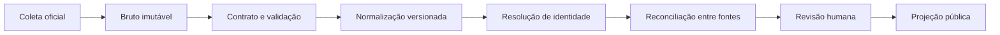

# Perfis públicos documentados

## Objetivo

O **Barreiras em Dados** terá uma página para cada agente político incluído por
critério público e verificável. O nome editorial é **perfil público
documentado**. “Dossiê”, “ficha de problemas” e expressões semelhantes não serão
usados na interface porque misturam fatos de naturezas diferentes e podem
sugerir culpa.

O perfil é uma composição de projeções aprovadas. Não é uma tabela única e não
autoriza coleta indiscriminada de vida privada.

## Ordem pública da interface

A página pública apresenta as pessoas nesta ordem, priorizando o vínculo
municipal e a compreensão popular:

1. prefeito, vice-prefeito e secretários;
2. vereadores;
3. deputados estaduais;
4. deputados federais;
5. candidatos registrados.

Uma seção sem coletor aprovado aparece como **fonte em preparação**. Ela não
exibe nomes inventados, zero como substituto de dado ausente ou avaliação sobre
quem ocupa o cargo. Atuação, indicações, projetos, leis, emendas, remuneração e
processos só entram quando houver fonte, período, identificador e evidência
própria.

## Quem entra

### Núcleo municipal

- prefeito e vice-prefeito;
- secretários municipais e ocupantes equivalentes, durante a vigência do ato;
- vereadores e integrantes da Mesa Diretora;
- ex-ocupantes, preservados em histórico;
- candidatos a cargos municipais registrados no TSE.

### Representação estadual e federal

Deputados estaduais e federais entram somente com um vínculo territorial
tipado, datado e sustentado por evidência. Exemplos:

- nascimento ou domicílio eleitoral oficialmente declarado em Barreiras;
- candidatura municipal anterior;
- escritório político oficial no Município;
- emenda, proposição ou atuação que cite Barreiras;
- outro vínculo aprovado editorialmente.

Deputado não será descrito como representante exclusivo de Barreiras. Votação
recebida no Município, amizade, presença em evento ou autodeclaração em rede
social não bastam, isoladamente, para confirmar o vínculo.

### Candidatos de 2026

O TSE publica o conjunto “Candidatos - 2026” com atualização diária. O portal
mostrará a situação oficial e o instante da última coleta. Pré-candidato
anunciado, convidado por partido ou citado na imprensa não será apresentado como
candidato registrado.

Mudanças de situação — pedido, deferimento, indeferimento, recurso, renúncia,
cassação, substituição ou falecimento — geram novas versões. A interface não
congela uma situação antiga como se fosse atual.

## Estrutura da página

### Identificação e cargo

- nome oficial e nome de urna, quando aplicável;
- fotografia oficial com fonte, licença/termo e data;
- cargo, órgão, partido, mandato e situação;
- ato de nomeação/exoneração ou identificador eleitoral;
- motivo e evidência do vínculo com Barreiras;
- data de atualização e cobertura da fonte.

### Remuneração pública

Mostrar separadamente:

- subsídio ou vencimento previsto em lei;
- remuneração bruta registrada por competência;
- verbas indenizatórias e diárias, quando a fonte permitir distingui-las;
- descontos apenas de forma agregada quando necessários para explicar o total;
- custo patronal, se disponível, em campo separado.

Não publicar descontos pessoais detalhados, conta bancária, CPF, endereço ou
outro dado sem necessidade pública demonstrada. “Salário”, “subsídio legal”,
“bruto pago”, “líquido” e “custo total” não são sinônimos.

### Declarações eleitorais

- eleição, cargo, unidade eleitoral e identificador da candidatura;
- situação da candidatura na coleta;
- bens exatamente como declarados ao TSE, por categoria e valor;
- total determinístico daquela declaração;
- correções e versões do conjunto;
- aviso de que é uma fotografia autodeclarada daquela eleição, não patrimônio
  atual nem avaliação de mercado.

Comparações entre eleições exigem metodologia publicada para moeda, inflação,
categorias, bens adicionados/removidos e candidaturas distintas. Não haverá
score automático de enriquecimento.

### Atuação legislativa

Quando aplicável:

- proposições, relatorias e comissões;
- sessões e presença conforme o conceito da casa legislativa;
- votações nominais e voto registrado;
- despesas parlamentares e respectivos documentos;
- emendas relacionadas a Barreiras, por estágio financeiro.

Ausência de voto nominal não significa ausência do parlamentar: a deliberação
pode ter sido simbólica, o parlamentar pode não integrar o universo esperado ou
a fonte pode estar incompleta. Presença em evento também não equivale
automaticamente a frequência regimental.

### Empresas e relações públicas

- pessoa jurídica, CNPJ público permitido, papel societário e período;
- fonte cadastral, data da observação e situação;
- contratos públicos em que a empresa aparece;
- método de resolução da identidade;
- evidência própria para cada relação.

Nome semelhante não cria relação pública. Vínculo societário não implica
favorecimento, influência, coordenação ou irregularidade. CPF completo de pessoa
natural fica restrito e cifrado quando for indispensável à reconciliação.

### Registros sancionatórios

CEIS, CNEP, CEPIM, CEAF, acordos de leniência e autos administrativos só podem
ser exibidos com:

- identificador exato do sancionado/autuado;
- órgão, número, fundamento e situação informados pela fonte;
- início, fim, recurso/efeito quando disponíveis;
- data da coleta, documento e contexto;
- revisão humana para vínculo com pessoa natural.

Sanção ou auto de uma empresa não é propagado automaticamente a sócios,
administradores, agentes públicos ou contratantes.

### Referências judiciais

Processo judicial, polo processual, decisão, condenação, recurso e trânsito em
julgado são fatos distintos. Uma referência só será publicável após:

1. identificação exata do processo e da pessoa;
2. confirmação do papel processual;
3. leitura do documento sustentador;
4. situação processual atualizada;
5. revisão jurídica e editorial;
6. possibilidade de correção e contextualização.

A API Pública do DataJud não fornece nomes das partes no contrato público
documentado e não será usada para busca automática de pessoas. Pesquisa por
nome em buscadores ou tribunais não cria registro publicável.

### Evidência, cobertura e correções

Toda seção terá:

- fontes utilizadas e não disponíveis;
- data/hora da coleta;
- cobertura temporal conhecida;
- acesso ao documento ou resposta original permitido;
- trecho sustentador quando documental;
- metodologia e versão;
- histórico de correções e canal de contestação.

## Modelo de dados proposto

`people` continua sendo a identidade humana central. Não será criada uma tabela
denormalizada de “dossiês”. As entidades futuras candidatas são:

- `territorial_relationships`;
- `public_mandates`;
- `political_candidacies`;
- `political_affiliations`;
- `compensation_records`;
- `legislative_sessions` e `session_attendances`;
- `legislative_propositions`;
- `legislative_votes` e `legislative_vote_records`;
- `parliamentary_expenses`;
- `parliamentary_amendments` e `amendment_financial_events`;
- `electoral_asset_declarations` e `electoral_assets`;
- `campaign_contributions`;
- `legal_entities` e `corporate_relationships`;
- `sanctions` e `administrative_notices`;
- `official_case_references`;
- `media_assets`;
- `relationship_assertions`.

Toda entidade derivada referencia `raw_records`/`raw_artifacts` por
`evidence_items`. Relações possuem evidência própria. Versões mantêm
`valid_from`, `valid_to`, `observed_at`, `collected_at` e supersessão.

## Resolução de identidade

### Ex-vereadores e mandatos históricos

Nomes encontrados em indicações e atos antigos não são comparados somente com a
legislatura atual. Eles entram em `political.historical_representatives` como
registro separado, com `source_pending` até que uma fonte oficial da Câmara ou
do processo legislativo sustente o período. Variações de nome ficam em
`political.historical_representative_aliases` e podem apontar para a sugestão
bruta que originou a revisão.

Somente registros `approved`, com URL e evidência próprias, entram na projeção
pública. A confirmação de que uma pessoa foi vereadora orienta a triagem, mas
não substitui a fonte oficial nem cria automaticamente um vínculo com o perfil
atual.

### Chaves aceitas

- identificador externo estável dentro da fonte;
- CNPJ exato para pessoa jurídica;
- CPF somente em área restrita, cifrado e com finalidade aprovada;
- decisão humana documentada apoiada por evidências independentes.

### Chaves insuficientes isoladamente

- nome, apelido ou nome de urna;
- município ou partido;
- cargo semelhante;
- fotografia;
- endereço aproximado;
- resultado de modelo de linguagem.

Correspondências incertas ficam como candidatas internas, nunca como arestas
públicas. IA pode sugerir pares para revisão, mas não decide identidade.

## Pipeline e ordem obrigatória

Coletores de fontes diferentes podem executar independentemente. As etapas
posteriores não podem executar “em qualquer ordem”. Nenhum ETL grava diretamente
na projeção pública.

## Primeiro recorte entregável

Após estabilizar o fluxo do Querido Diário:

1. cadastrar internamente prefeito, vice, secretários e vereadores a partir de
   fontes oficiais;
2. publicar somente identificação, cargo, vigência e evidência aprovadas;
3. acrescentar remuneração legal e bruta por competência;
4. importar candidaturas de 2024 e 2026;
5. acrescentar bens declarados por eleição;
6. ativar atividade legislativa e despesas;
7. só então testar relações societárias e registros reputacionais.

Módulos ainda não aprovados aparecerão como “fonte em preparação”, não como
zero, inexistente ou “ficha limpa”.
